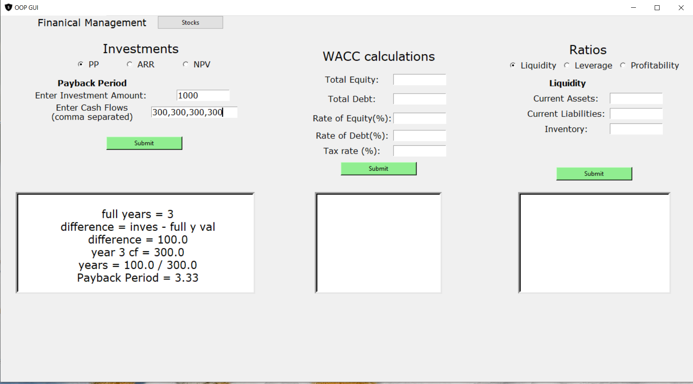

# Python-Projects
## Example 1: Finance App / app.py
#### GUI application which fetches live stock price data and plots a graph of the last Open and last Close. The user can search for companies in the search field (it does not have to be exact). If more than 1 company is found under the search results, then it will show top 4 matches from which a user can choose.
 
#### The app also has a financial management tab in which it calculates many different things such as : PaybackPeriod, Accounting Rate of Return and Net Present Value , as well as  WACC and financial ratios such as Liquidity, Prrofitability and Leverage. 

 

### Technologies
Project is created with:
* Python 3
* Tkinter
* Pandas
* Matplotlib
* BeautifulSoup4

